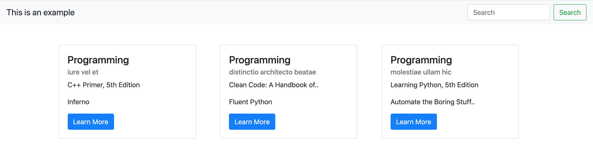

# HTML/CSS Card with Django

An app that shows how to create a basic html/css [card](https://materializecss.com/cards.html) with the help of [bootstrap](https://getbootstrap.com/docs/4.0/components/card/) and [django](https://www.djangoproject.com/).



The client script is written in [Python](https://www.python.org/), 
so make sure you have [Python](https://www.python.org/) installed.

(recommended): *setup [pipenv](https://pipenv.readthedocs.io/en/latest/), [virtualenv](https://virtualenv.pypa.io/en/latest/) or [virtualenvwrapper](https://virtualenvwrapper.readthedocs.io/en/latest/)*

##### Usage

```console
$ cd {APP_DIRECTORY} && pip install -r requirements.txt
```

```bash
# initial setup
$ ./manage.py migrate
# make migrations
$ ./manage.py makemigrations books
# run app
./manage.py runserver 9000
```
